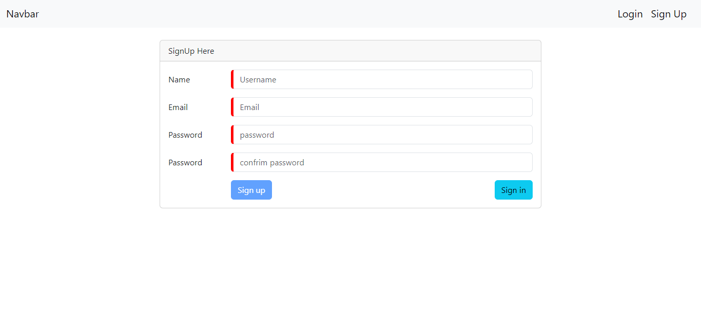
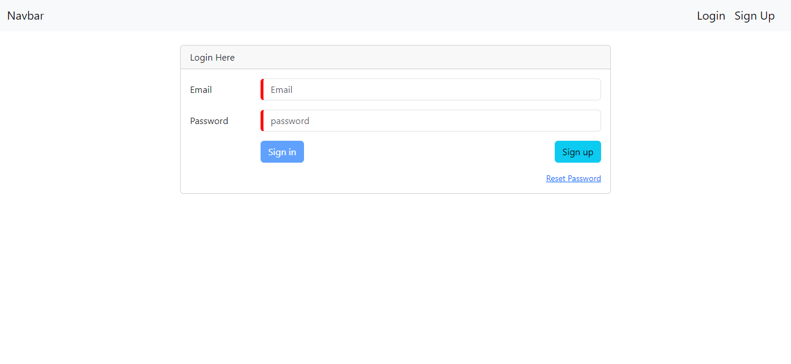
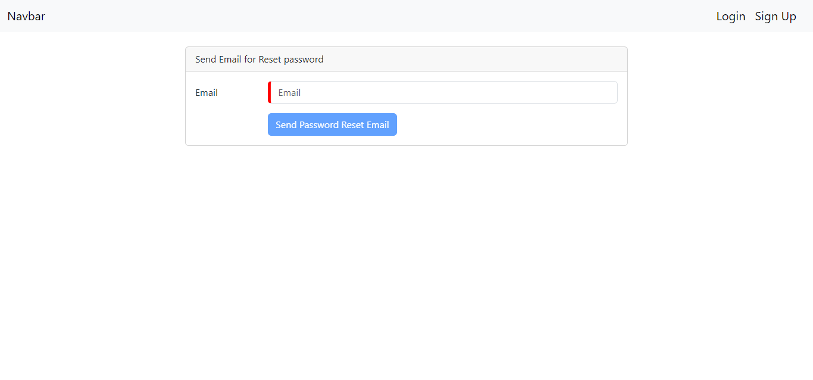
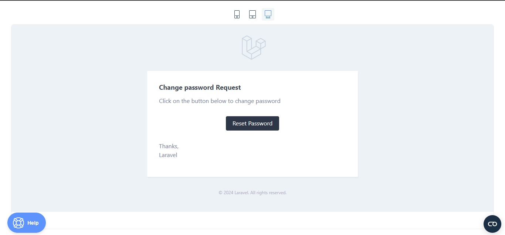
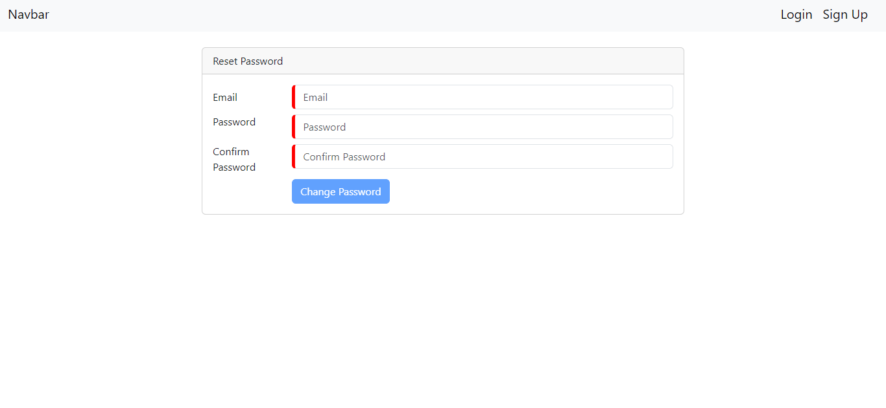

# Project README

## Overview

This project combines an Angular frontend (v18) with a Laravel backend (v10) to create a full-stack web application. It includes features like user authentication, password reset, and more.

## Setup

### Requirements

- Docker installed on your machine
- Docker Compose installed on your machine

To build and start the containers, navigate to the project root directory in your terminal and run:

```bash
docker-compose up --build
```

## Database
The project uses SQLite as the database. The database file (database.sqlite) will be created automatically in the Laravel application directory.

## Password Reset Feature
For the password reset feature to work, you need to use your own Mailtrap credentials in the Laravel .env file. Update the following variables in the .env file with your Mailtrap credentials:

## Screenshots


# Signup


# Login


# LandingPage


# PasswordReset


# MailTrapResetEmail


# ResetPasswordForm



